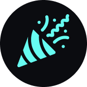

# Happy Wins

This project was inspired by [The Odin Project's Rails
course](https://www.theodinproject.com/paths/full-stack-ruby-on-rails/courses/ruby-on-rails/lessons/ruby-on-rails-ruby-on-rails).
Instead of a traditional blog app, I wrapped the project in the theme of
community celebrations, sharing wins
or resources along the learning journey.

[View the Project Live](https://limitless-bastion-29745.herokuapp.com)
 (Uses the free tier on Heroku, so please give it a moment to load.)

## View Locally
This website was built using Ruby on Rails. I used webpack to compile the styles
(Bootstrap and custom scss). The `main` branch deploys using
[Heroku](https://www.heroku.com/). To view this project locally:
1. Clone the repo.
2. Navigate into the folder locally.
3. Ensure you are using Ruby 3.0.2 (e.g. `rvm list`).
4. Install gems - `bundle install`.
5. Install frontend dependencies - `yarn`.
6. Setup the Postgres database – `rails db:setup`.
(If you don't have PostgreSQL installed run `brew install postgresql`.)
7. Run the database migrations - `rails db:migrate`.
8. Start the rails server - `rails s`.
